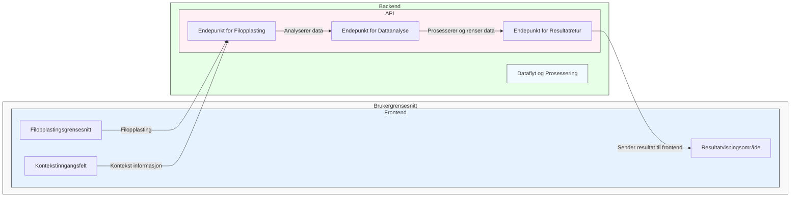

## Skisse for systemarkitektur

```mermaid
graph LR
  style UserInterface fill:#f9f9f9,stroke:#333333,stroke-width:1px
  style Frontend fill:#e6f3ff,stroke:#333333,stroke-width:1px
  style Backend fill:#e6ffe6,stroke:#333333,stroke-width:1px
  style API fill:#fff0f5,stroke:#333333,stroke-width:1px
  style Workflow fill:#f0faff,stroke:#333333,stroke-width:1px

  subgraph UserInterface ["Brukergrensesnitt"]
    subgraph Frontend ["Frontend"]
      FileUpload[Filopplastingsgrensesnitt]
      ContextInput[Kontekstinngangsfelt]
      ResultsDisplay[Resultatvisningsområde]
    end
  end

  subgraph Backend ["Backend"]
    subgraph API ["API"]
      UploadEndpoint[Endepunkt for Filopplasting]
      AnalysisEndpoint[Endepunkt for Dataanalyse]
      ResultsEndpoint[Endepunkt for Resultatretur]
    end
    Workflow[Dataflyt og Prosessering]
  end

  FileUpload -->|Filopplasting| UploadEndpoint
  ContextInput -->|Kontekst informasjon| UploadEndpoint
  UploadEndpoint -->|Analyserer data| AnalysisEndpoint
  AnalysisEndpoint -->|Prosesserer og renser data| ResultsEndpoint
  ResultsEndpoint -->|Sender resultat til frontend| ResultsDisplay
```
